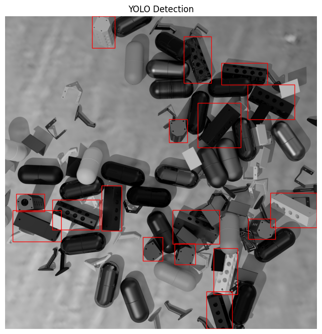
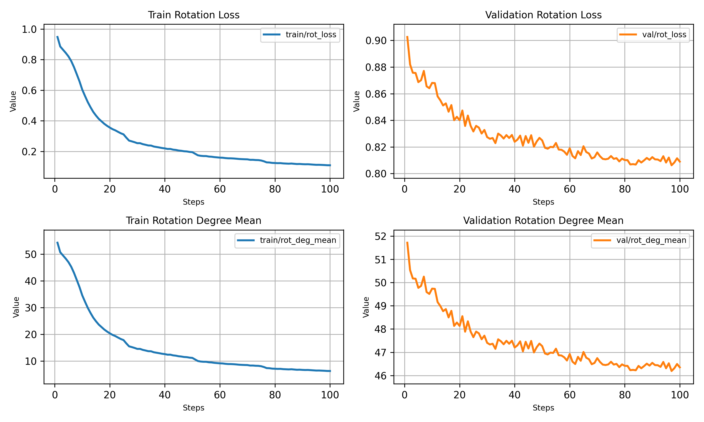
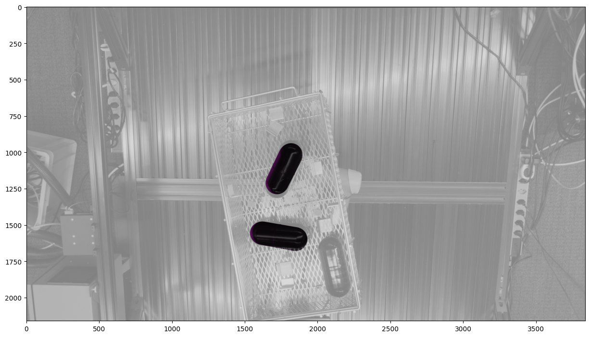
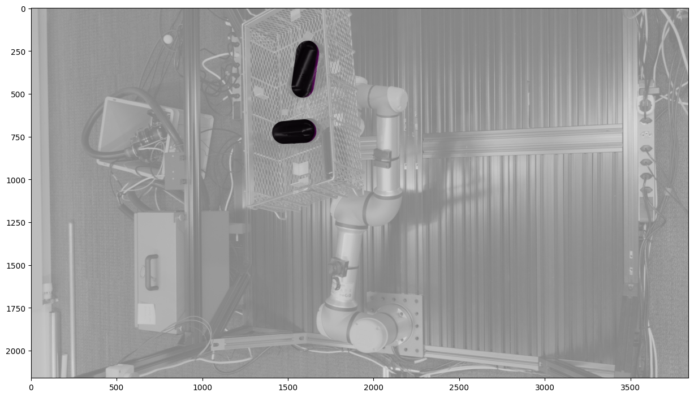
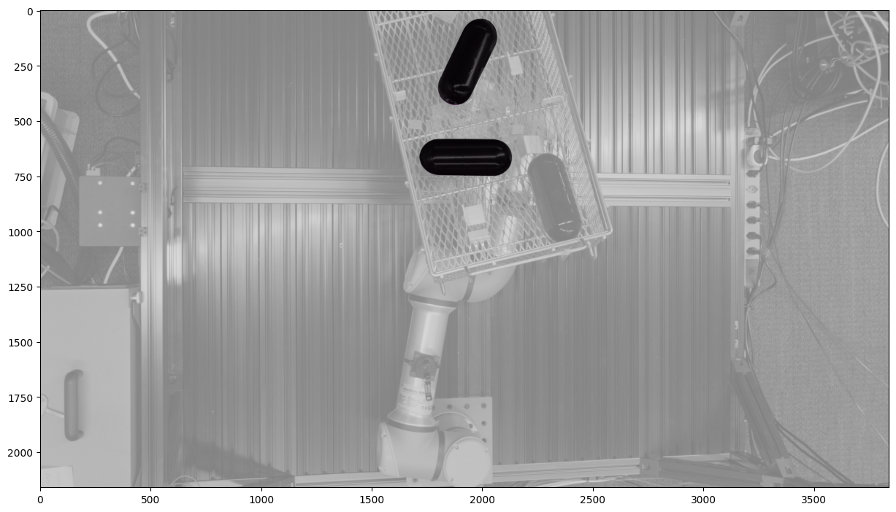

# BPC Baseline for BOP Challenge

## Introduction

This repository provides the **BPC Baseline** for the **BOP 2025 Challenge**, offering a structured and reproducible pipeline for **6DoF object pose estimation**. Our approach utilizes **YOLO v11** for object detection and a **ResNet50-based SimplePoseNet** for pose estimation. The goal is to make this implementation accessible for participants with minimal experience in AI and computer vision.

### Dataset: Industrial Plenoptic Dataset (IPD)

The dataset used in this baseline is the **Industrial Plenoptic Dataset (IPD)**, introduced in the CVPR 2024 paper: ["Towards Co-Evaluation of Cameras, HDR, and Algorithms for Industrial-Grade 6DoF Pose Estimation"](https://github.com/intrinsic-ai/ipd) by Kalra et al. IPD is designed for **industrial-grade 6DoF pose estimation** and contains:
- **2,300 physical scenes** with **22 industrial parts**
- **100,000+ object views** captured with **13 calibrated multi-modal cameras**
- **4 different exposure levels** and **3 challenging lighting conditions** (100 lux to 100,000 lux)
- **Polarization images, HDR captures, and high-resolution structured light data**

The dataset follows the **BOP-scenewise format** but includes **three different cameras**, which enhances multi-view pose estimation and refinement.

We will first introduce the **dataset structure and annotation files**, followed by an in-depth explanation of our **object detection and pose estimation pipeline**.

---

## Dataset Structure

The dataset follows the **BOP-scenewise format**, which organizes data into **scenes**, each containing images, depth maps, object masks, and annotations. However, IPD introduces **three distinct cameras**, requiring additional camera-specific JSON files.

### Directory Structure

```
datasets/
├── models_eval/              # Evaluation models (resampled 3D models)
├── models/                   # Original 3D object models
├── train_pbr/                # Photorealistic synthetic training data
│   ├── 000000/
│   │   ├── scene_gt_info_cam1.json   # Ground truth info (camera 1)
│   │   ├── scene_gt_info_cam2.json   # Ground truth info (camera 2)
│   │   ├── scene_gt_info_cam3.json   # Ground truth info (camera 3)
│   │   ├── rgb_cam1/                 # RGB images (camera 1)
│   │   ├── depth_cam1/               # Depth images (camera 1)
│   │   ├── mask_cam1/                # Object segmentation masks (camera 1)
│   │   ├── rgb_cam2/                 # RGB images (camera 2)
│   │   ├── depth_cam2/               # Depth images (camera 2)
│   │   ├── mask_cam2/                # Object segmentation masks (camera 2)
│   │   ├── rgb_cam3/                 # RGB images (camera 3)
│   │   ├── depth_cam3/               # Depth images (camera 3)
│   │   ├── mask_cam3/                # Object segmentation masks (camera 3)
│   │   ├── scene_camera_cam1.json    # Camera parameters (cam1)
│   │   ├── scene_camera_cam2.json    # Camera parameters (cam2)
│   │   ├── scene_camera_cam3.json    # Camera parameters (cam3)
│   │   ├── scene_gt_cam1.json        # Object ground truth poses (cam1)
│   │   ├── scene_gt_cam2.json        # Object ground truth poses (cam2)
│   │   ├── scene_gt_cam3.json        # Object ground truth poses (cam3)
```

### JSON File Descriptions

| JSON File | Description | Purpose |
|-----------|------------|---------|
| `scene_camera_camX.json` | Stores camera intrinsic (`cam_K`) and extrinsic parameters (`cam_R_w2c`, `cam_t_w2c`) for camera `X`. | Used for 3D-to-2D projection and depth scaling. |
| `scene_gt_camX.json` | Contains object ground-truth **6DoF poses**, including rotation (`cam_R_m2c`) and translation (`cam_t_m2c`). | Used for evaluation and training pose estimation models. |
| `scene_gt_info_camX.json` | Stores object bounding boxes (`bbox_obj`), visibility (`visib_fract`), and pixel counts (`px_count_all`). | Provides object segmentation and visibility data. |
| `models/models_info.json` | Stores **3D object model metadata**, including object diameters, bounding boxes, and **symmetry information**. | Used for rendering, evaluation, and **handling symmetrical objects** during pose estimation. |

---

### Example: Camera Intrinsic and Pose Information

Below is an example of **camera parameters** from `scene_camera_cam1.json`:

```json
{
  "0": {
    "cam_K": [4209.025366776721, 0.0, 1200.0, 0.0, 4209.025366776721, 1200.0, 0.0, 0.0, 1.0],
    "depth_scale": 0.1,
    "cam_R_w2c": [-0.3724, 0.9252, -0.0724, 0.9280, 0.3713, -0.0290, -0.0, -0.0780, -0.9969],
    "cam_t_w2c": [119.09, 47.79, 1648.71]
  }
}
```

- **`cam_K`**: The **intrinsic matrix** defining focal length and optical center for 3D projection.
- **`depth_scale`**: Converts **depth image values** to millimeters.
- **`cam_R_w2c`**: The **rotation matrix** that transforms points from the **world coordinate system** to the **camera coordinate system**.
- **`cam_t_w2c`**: The **translation vector** defining the camera's position in the **world coordinate system**.

### Example: Object Pose Information

Below is an example of **ground-truth object pose** from `scene_gt_cam1.json`:

```json
{
  "0": [
    {
      "obj_id": 14,
      "cam_R_m2c": [0.3181, -0.8292, 0.4594, 0.7644, -0.0622, -0.6416, 0.5606, 0.5554, 0.6141],
      "cam_t_m2c": [226.04, -150.47, 1583.51]
    }
  ]
}
```

- **`obj_id`**: The **unique identifier** of the object.
- **`cam_R_m2c`**: The **rotation matrix** from the object model frame to the **camera coordinate system**.
- **`cam_t_m2c`**: The **translation vector**, giving the object’s position relative to the camera.

### Example: Object Bounding Box and Visibility Information

Below is an example of **bounding box and visibility data** from `scene_gt_info_cam1.json`:

```json
{
  "0": [
    {
      "bbox_obj": [1276.0, 570.0, 443.0, 208.0],
      "bbox_visib": [1277.0, 571.0, 442.0, 207.0],
      "px_count_all": 80763.0,
      "px_count_valid": 80763.0,
      "px_count_visib": 79908.0,
      "visib_fract": 0.9894
    },
  ]
}
```

- **`bbox_obj`**: The **full object bounding box** in the format `[x, y, width, height]`, where `(x, y)` is the top-left corner.
- **`bbox_visib`**: The **visible portion of the bounding box**, accounting for occlusions.
- **`px_count_all`**: Total number of **pixels** occupied by the object in the image.
- **`px_count_valid`**: Number of **valid pixels** (with valid depth measurements).
- **`px_count_visib`**: Number of **visible pixels** of the object.
- **`visib_fract`**: The **visibility fraction** of the object, computed as `px_count_visib / px_count_all`.

---

## Dataset Example: Synthetic vs. Real Data

The dataset consists of both **synthetic** and **real-world** images. Synthetic data is generated using **photorealistic rendering** techniques, whereas real-world images are captured using **calibrated cameras in controlled environments**.


**Synthetic Image (from `train_pbr` set)**  
<p align="center">
  
</p>

**Real-world Image (from `val` set)**  
<p align="center">
  
</p>


### Key Concepts Explained

To better understand the dataset and its annotations, here are some essential concepts related to **camera parameters, object poses, and bounding boxes**:

| Concept | Explanation |
|---------|------------|
| **Intrinsic Camera Matrix (`cam_K`)** | A **3×3 matrix** that defines the camera’s internal parameters, including focal length and optical center. It is used to project **3D points onto a 2D image plane**. The general form is: $$
K = \begin{bmatrix}
f_x & 0   & c_x \\
0   & f_y & c_y \\
0   & 0   & 1
\end{bmatrix}
$$ where $$( f_x, f_y )$$ are the focal lengths and $$( c_x, c_y )$$ are the optical center coordinates. |
| **Depth Scale (`depth_scale`)** | A factor to convert raw depth values to **millimeters**. If the dataset provides depth in arbitrary units, this scale ensures correct **metric depth values**. |
| **Rotation Matrix (`cam_R_w2c`, `cam_R_m2c`)** | A **3×3 matrix** that describes the rotation of a coordinate system. It transforms points from one coordinate system to another (e.g., world → camera or model → camera). The matrix must satisfy $$ R^T R = I $$ meaning it's **orthonormal**. |
| **Translation Vector (`cam_t_w2c`, `cam_t_m2c`)** | A **3×1 vector** that defines the translation (shift) of a coordinate system. It moves points from one coordinate system to another. The full transformation from world to image coordinates is:  $P_i = K \begin{bmatrix} R & t \end{bmatrix} P_w$ where $P_w$ is a **3D point in world coordinates**, and $P_i$ is its **2D projection in image coordinates**. |
| **Bounding Box (`bbox_obj`, `bbox_visib`)** | The **rectangular region** surrounding an object in the image. `bbox_obj` refers to the **full bounding box**, while `bbox_visib` includes **only the visible part** of the object. |
| **Visibility Fraction (`visib_fract`)** | A value between **0 and 1**, representing how much of the object is visible in the image. Computed as: <br> $$ visib\_fract = \frac{\text{px\_count\_visib}}{\text{px\_count\_all}} $$ where `px_count_visib` is the number of visible pixels and `px_count_all` is the total object pixel count. |
| **Symmetry in Objects (`symmetries_continuous`, `symmetries_discrete`)** | Some objects **look identical under certain transformations**. Symmetries can be **continuous** (e.g., cylinders, which can rotate infinitely around an axis) or **discrete** (e.g., a square can rotate by **90° steps** and remain unchanged). Handling symmetries is important for **pose estimation**. |

<!-----

### Summary

- The **dataset follows BOP format** with **three cameras**.
- Camera parameters are stored in **scene_camera_camX.json**.
- Object **6DoF poses** are in **scene_gt_camX.json**.
- Bounding box and visibility info are in **scene_gt_info_camX.json**.
- `models_info.json` provides **detailed object metadata including symmetry information**, which is crucial for **handling symmetrical objects** in pose estimation.

Next, we will discuss **YOLO v11-based object detection** and how detections are used for **pose estimation and refinement**.-->


---

## **Pipeline Overview**  

### **1. Object Detection with YOLO v11**  

Object detection is the first step in our **6DoF pose estimation pipeline**. We use **Ultralytics YOLO v11**, a state-of-the-art object detection model, to locate objects in the input images and extract their **(cx, cy)** coordinates, which are later used for 3D pose estimation. More details on YOLO v11 can be found in the official documentation: [Ultralytics YOLO11](https://docs.ultralytics.com/models/yolo11/).  

#### **Why YOLO?**  

YOLO ("You Only Look Once") is a fast, real-time object detection model introduced by Redmon et al. in [this paper](https://arxiv.org/abs/1506.02640). It works by splitting an image into a grid and predicting bounding boxes, class probabilities, and confidence scores for each grid cell in **a single forward pass**. This makes it much faster than traditional two-stage detectors like Faster R-CNN.  

#### **Why Train One Model Per Object?**  

In our approach, we train a **separate YOLO model for each object**. This means:  
- Each model is **specialized** to detect one object, leading to **higher accuracy**.  
- The detected **$(c_x, c_y)$** coordinates help in estimating the **$(X, Y, Z)$** pose, which will be further explained in the evaluation section.  

---

### **Preparing the Dataset for YOLO Training**  

Before training YOLO, we need to **clone the repository and prepare the dataset**. Follow these steps:  

#### **Cloning the Repository**  

First, clone the repository and navigate into it:  

```bash
git clone https://github.com/CIRP-Lab/bpc_baseline.git
cd bpc_baseline
```

#### **Downloading the Dataset**  

Run the following script to download and extract the dataset:  

```bash
bash download_data.sh
```

After running the script, the dataset will be extracted into the `datasets/` folder, and the structure should look like this:  

```
datasets/
├── train_pbr/
├── val/
├── models/
├── models_eval/
```
---

### **Environment Setup**  

To run the pipeline, you need to set up the **Docker environment**. The provided setup has been tested on **Ubuntu with an NVIDIA GPU**, and the environment is named **bop**.  

#### **Building the Docker Container**  

```bash
cd docker/
docker build . -t bpc:2025.1.31
```

#### **Running the Docker Container**  

```bash
docker run -p 8888:8888 --shm-size=1g --runtime nvidia --gpus all -v $(pwd):/code -ti bpc:2025.1.31 bash
cd /code
```

<!-----
For detailed environment setup instructions, please refer to the [official GitHub repository](https://github.com/CIRP-Lab/bpc_baseline.git).
-->
---

### **Generating Labels for YOLO Training**  

To prepare the dataset for YOLO, we filter images based on the **object ID** and generate bounding box labels using the following script:  

```bash
python3 bpc/yolo/prepare_data.py \
    --dataset_path "datasets/train_pbr" \
    --output_path "datasets/yolo11/train_obj_1" \
    --obj_id 1
```

Example output:  

```
Processing train_pbr scenes: 100%|███████████████████████| 10/10 [00:03<00:00,  3.02it/s]
[INFO] Generated YAML file at: bpc/yolo/configs/data_obj_1.yaml
[INFO] Dataset preparation complete!
```

This script:  
1. **Extracts bounding boxes** for the specified object (`obj_id`).  
2. **Copies the images** and saves the bounding box labels in YOLO format.  
3. **Generates a YAML file** for YOLO training (`data_obj_1.yaml`).  

---

### **Training YOLO v11 for Object Detection**  

Now, we train YOLO using **Ultralytics' YOLO11 library**:  

```bash
python3 bpc/yolo/train.py \
    --obj_id 1 \
    --data_path "bpc/yolo/configs/data_obj_1.yaml" \
    --epochs 100 \
    --imgsz 640 \
    --batch 16 \
    --task detection
```

This script:  
1. Loads the YOLO v11 model (`yolo11n.pt`), which will be automatically downloaded by the Ultralytics library.  
2. Trains on the dataset defined in `data_obj_1.yaml`.  
3. Saves the trained model in:  

   ```
   bpc/yolo/models/detection/obj_1/yolo11-detection-obj_1.pt
   ```

💡 **Important Notes:**  
- **Ultralytics YOLO v11 will automatically generate a `runs/` folder** inside the repository. This folder contains:  
  - **Loss curves** for training and validation.  
  - **Detection visualizations** to inspect predictions.  
  - **Training logs** detailing model performance.  
- For our baseline, we **use all images from `train_pbr/` as both training and validation data** to deliberately **overfit the model on a single object**. This ensures that the object is correctly detected before proceeding to pose estimation.  
- **Participants are encouraged to modify the code** to create a proper **train-validation split** within `train_pbr/` for better generalization.  

---

### **Verifying YOLO Training Results**  

Once training is complete, we can verify the model’s performance using a sample image:  

```python
import cv2
from ultralytics import YOLO
import matplotlib.pyplot as plt

# Paths
model_path = "bpc/yolo/models/detection/obj_11/yolo11-detection-obj_11.pt"
image_path = "datasets/train_pbr/000005/rgb_cam1/000001.jpg"

# Load YOLO model
model = YOLO(model_path)

# Load image using OpenCV
img_bgr = cv2.imread(image_path)
if img_bgr is None:
    raise ValueError(f"Failed to load image: {image_path}")

# Convert BGR to RGB (Matplotlib expects RGB format)
img_rgb = cv2.cvtColor(img_bgr, cv2.COLOR_BGR2RGB)

# Run YOLO inference
results = model(img_rgb)[0]

# Draw detections directly on the image
for box in results.boxes.xyxy:
    x1, y1, x2, y2 = map(int, box[:4])
    cv2.rectangle(img_rgb, (x1, y1), (x2, y2), (255, 0, 0), 3)  # Draw bounding box in blue

# Display the image using Matplotlib
plt.figure(figsize=(8, 8))
plt.imshow(img_rgb)
plt.axis("off")  # Hide axis
plt.title("YOLO Detection")
plt.show()
```

**Example Output:**  
<p align="center">
  
</p>

⚠ **Note:** This test only verifies if the model can **overfit on synthetic data**.  

---

### **2. Pose Estimation with ResNet50 Backbone**  

After detecting objects, we use SimplePoseNet, a ResNet50-based network, to estimate the 6DoF pose of objects. Unlike the evaluation stage, where YOLO is used for object detection, the pose estimation model is trained directly on ground-truth bounding boxes from the dataset. The pose estimation pipeline consists of multiple key components, each handling a specific aspect of data processing, training, and evaluation:

- **`train_pose.py`**: The main script for training, responsible for loading data, initializing the model, setting the loss function, and running the training process.  
- **`data_utils.py`**: Implements the **dataloader (`BOPSingleObjDataset`)**, handling dataset loading, object cropping, image augmentation, and generating labels for training.  
- **`simple_pose_net.py`**: Defines **SimplePoseNet**, a ResNet50-based model that predicts **6DoF poses** from input images.  
- **`losses.py`**: Implements various **pose loss functions**, including **Euler angles, quaternions, and 6D representations**, along with a **symmetry-aware loss** for handling symmetric objects.  
- **`trainer.py`**: Manages the **training loop**, applying loss functions, logging results, and saving checkpoints.  

Since **data preprocessing is crucial** for effective model training, we will first focus on the **dataloader (`data_utils.py`)**, which prepares images and labels for training. This involves:

- **Splitting the dataset** into training and validation sets.  
- **Extracting and cropping objects** from images using bounding boxes.  
- **Applying image processing techniques**, such as normalization and resizing.  
- **Augmenting images** during training to improve generalization.  
- **Generating three different pose labels** (Euler angles, quaternions, and 6D representations).  

Next, we will **break down each step in the dataloader** and explain how data is preprocessed before being fed into the model. 🚀  

---

### **Building the Dataset for Pose Estimation**

This section describes how we **create training and validation sets**, **crop object images**, **apply augmentations**, and **generate rotation labels** for the **SimplePoseNet** model. We rely on **BOP-style** annotation files (`scene_gt_info_camX.json`, `scene_camera_camX.json`, `scene_gt_camX.json`) to load bounding boxes, camera intrinsics, and ground-truth object poses.

---

#### **1. Dataset Splitting**  

Before training the pose estimation model, we must **build the dataset** by reading the ground-truth JSON files stored in the **BOP-scenewise format**. The dataset is **split 80:20** at the **image level**, ensuring that all corresponding images from different camera views (`rgb_cam1`, `rgb_cam2`, `rgb_cam3`) remain in the same split.  

Each scene directory (e.g., `000000/`, `000001/`) inside `train_pbr/` contains **RGB images from three cameras (`cam1`, `cam2`, `cam3`)**, along with annotation files. The dataset splitting is performed as follows:

- **For each scene (`scene_id`) and each camera (`cam_id`)**, we gather all image IDs.  
- **Images within a scene are shuffled and split 80:20** into training and validation sets.  
- If an image (e.g., `000000.jpg`) is placed in the training set, then **all its corresponding images from `rgb_cam1/`, `rgb_cam2/`, and `rgb_cam3/` will also be placed in the training set**.  
- This ensures that each object instance appears in either the training or validation set, but never in both.  

#### **Example of Train/Validation Split**  

For a scene `000000/`, if the **first 80% of images (e.g., `000000.jpg` to `000079.jpg`)** are assigned to the training set, then:  

- `train_pbr/000000/rgb_cam1/000000.jpg` → **Train**  
- `train_pbr/000000/rgb_cam2/000000.jpg` → **Train**  
- `train_pbr/000000/rgb_cam3/000000.jpg` → **Train**  
- ...  
- `train_pbr/000000/rgb_cam1/000080.jpg` → **Validation**  
- `train_pbr/000000/rgb_cam2/000080.jpg` → **Validation**  
- `train_pbr/000000/rgb_cam3/000080.jpg` → **Validation**  

This process is repeated for all scenes in `train_pbr/`, ensuring a **consistent split** of images across all camera views.

#### **Dataset Structure**  

The dataset follows the **BOP-scenewise format**, where each scene contains **RGB images**, **ground-truth bounding box information**, **camera intrinsics**, and **object poses** for three different cameras. These annotations are stored in corresponding **JSON files**.

```
datasets/
├── models_eval/              # Evaluation models (resampled 3D models)
├── models/                   # Original 3D object models
├── train_pbr/                # Photorealistic synthetic training data
│   ├── 000000/               # Scene 000000
│   │   ├── scene_gt_info_cam1.json   # Ground truth info (camera 1)
│   │   ├── scene_gt_info_cam2.json   # Ground truth info (camera 2)
│   │   ├── scene_gt_info_cam3.json   # Ground truth info (camera 3)
│   │   ├── rgb_cam1/                 # RGB images (camera 1)
│   │   │   ├── 000000.jpg
│   │   │   ├── 000001.jpg
│   │   ├── rgb_cam2/                 # RGB images (camera 2)
│   │   │   ├── 000000.jpg
│   │   │   ├── 000001.jpg
│   │   ├── rgb_cam3/                 # RGB images (camera 3)
│   │   │   ├── 000000.jpg
│   │   │   ├── 000001.jpg
│   ├── 000001/               # Scene 000001
│   ├── 000002/               # Scene 000002
│   ├── ...
```

By structuring the dataset in this way, we ensure **uniform distribution** across **different viewpoints and lighting conditions**, while avoiding data leakage between the training and validation sets.

---
#### **2. Object Cropping and Image Processing**

For each sample, we retrieve these items from the BOP annotation files:

1. **Bounding Box** (`bbox_visib` from `scene_gt_info_camX.json`):  
   - Defines the **visible region** of the object in the image (accounting for occlusions).
   - Used to crop the object from the full-size image.

2. **Camera Intrinsics** (`K` from `scene_camera_camX.json`):  
   - A 3×3 matrix used for projecting 3D points to 2D.
   - In training, we primarily use it to understand object scaling but not for direct input to the network.

3. **Ground-Truth Pose** (`R` and `t` from `scene_gt_camX.json`):  
   - A 3×3 rotation matrix (`R`) and a 3×1 translation vector (`t`) describing the object’s **6DoF pose**.
   - We derive **Euler angles**, **quaternions**, or **6D rotation** labels from this matrix.

4. **RGB Image Path** (`rgb_camX/` folder):  
   - Points to the **actual image** from which we crop the object region.

##### **Letterbox Resizing**

After extracting the bounding box, we use **letterbox resizing** to preserve the object’s **aspect ratio** while fitting it into a uniform `target_size` (256×256 by default). This avoids distortion and ensures **consistent input dimensions** for the network.

#### **3. Data Augmentation (Training Only)**

To improve generalization, **on-the-fly** augmentations are applied when `split="train"` and `augment=True`:

- **Random Scaling** (±20%): Enlarges or shrinks the bounding box region.
- **Random Translation** (±10%): Shifts the cropped region to simulate positional variability.
- **Color Jitter**: Varies brightness, contrast, saturation, and hue.
- **Normalization**: Applies ImageNet mean/std to match **ResNet50** preprocessing conventions.

During validation (`split="val"`), **no augmentation** is performed, ensuring we measure the model’s performance on unmodified data.

---

#### **4. Generating Rotation Labels**

Since the goal is **6DoF** (3D rotation + translation) pose estimation, we generate rotation labels from the ground-truth rotation matrix
$$
\mathbf{R} \in \mathbb{R}^{3 \times 3}
$$
(provided in `scene_gt_camX.json`). Each sample includes three rotation representations.

For a given ground-truth pose:
- **Rotation Matrix**: 
  $$
  \mathbf{R} \in \mathbb{R}^{3 \times 3}
  $$
- **Translation Vector**:
  $$
  \mathbf{t} \in \mathbb{R}^{3 \times 1}
  $$

From **R**, we derive **Euler angles**, **quaternions**, and **6D rotation representations**.

---

#### 1. Euler Angles $(R_x, R_y, R_z)$

Euler angles represent rotations about the X, Y, and Z axes (in radians).

#### Conversion from Rotation Matrix to Euler Angles

Define:
$$
s_y = \sqrt{R_{0,0}^2 + R_{1,0}^2}
$$

- **If** $(s_y \geq 10^{-6})$:
  $$
  \begin{aligned}
  R_x &= \operatorname{atan2}(R_{2,1}, R_{2,2}) \\
  R_y &= \operatorname{atan2}(-R_{2,0}, s_y) \\
  R_z &= \operatorname{atan2}(R_{1,0}, R_{0,0})
  \end{aligned}
  $$
- **Else** (singular case):
  $$
  \begin{aligned}
  R_x &= \operatorname{atan2}(-R_{1,2}, R_{1,1}) \\
  R_y &= \operatorname{atan2}(-R_{2,0}, s_y) \\
  R_z &= 0
  \end{aligned}
  $$

#### Example Calculation

Given:
$$
\mathbf{R} =
\begin{bmatrix}
0.866 & -0.5 & 0 \\
0.5   & 0.866 & 0 \\
0     & 0     & 1
\end{bmatrix},
$$
we compute:


$R_x = \operatorname{atan2}(0, 1) = 0$


$R_y = \operatorname{atan2}(0, \sqrt{0.866^2 + 0.5^2}) = 0$


$R_z = \operatorname{atan2}(0.5, 0.866) \approx 0.523 \, \text{rad} \quad (\approx 30^\circ)$

Thus, the **Euler angle representation** is:

$$
[0, 0, 0.523]
$$

---

#### 2. Quaternion $(x, y, z, w)$

Quaternions provide a 4D representation that avoids gimbal lock.

#### Conversion from Rotation Matrix to Quaternion

The conversion formulas are:
$$
\begin{aligned}
w &= \frac{1}{2}\sqrt{1 + R_{0,0} + R_{1,1} + R_{2,2}}, \\
x &= \frac{R_{2,1} - R_{1,2}}{4w}, \\
y &= \frac{R_{0,2} - R_{2,0}}{4w}, \\
z &= \frac{R_{1,0} - R_{0,1}}{4w}.
\end{aligned}
$$

#### Example Calculation

For the same rotation matrix:
$$
\mathbf{R} =
\begin{bmatrix}
0.866 & -0.5 & 0 \\
0.5   & 0.866 & 0 \\
0     & 0     & 1
\end{bmatrix},
$$
we compute:

$w \approx 0.9659$

$x = 0$

$y = 0$

$z \approx \frac{0.5 - (-0.5)}{4 \times 0.9659} \approx 0.2588$

Thus, the quaternion is:
$$
[0,\ 0,\ 0.2588,\ 0.9659]
$$

---

#### 3. 6D Rotation Representation $R(r_1, r_2)$

This representation encodes the rotation using the first two columns of the rotation matrix.

#### Conversion from Rotation Matrix to 6D Representation

Extract:
$$
r_1 = \begin{bmatrix} R_{0,0} \\ R_{1,0} \\ R_{2,0} \end{bmatrix}, \quad
r_2 = \begin{bmatrix} R_{0,1} \\ R_{1,1} \\ R_{2,1} \end{bmatrix}.
$$

#### Example Calculation

For the same rotation matrix:
$$
\mathbf{R} =
\begin{bmatrix}
0.866 & -0.5 & 0 \\
0.5   & 0.866 & 0 \\
0     & 0     & 1
\end{bmatrix},
$$
we have:
$$
r_1 = [0.866,\ 0.5,\ 0], \quad r_2 = [-0.5,\ 0.866,\ 0].
$$

Thus, the 6D representation is:
$$
[0.866,\ 0.5,\ 0,\ -0.5,\ 0.866,\ 0]
$$

---

#### Example Label Dictionary

Each image's labels are stored as follows:
```python
label_dict = {
    "euler": torch.tensor([0, 0, 0.523], dtype=torch.float32),
    "quat":  torch.tensor([0, 0, 0.2588, 0.9659], dtype=torch.float32),
    "6d":    torch.tensor([0.866, 0.5, 0, -0.5, 0.866, 0], dtype=torch.float32)
}
```

---

#### **Summary of Rotation Representations**  

| **Label Type**         | **Description**                                               | **Advantages**                         |
|------------------------|---------------------------------------------------------------|----------------------------------------|
| **Euler Angles**       | 3 values $(R_x, R_y, R_z)$ representing rotations (in radians).  | Simple, but can suffer from gimbal lock. |
| **Quaternions**        | 4D representation $((x, y, z, w))$ that avoids gimbal lock.         | More stable, though less intuitive.    |
| **6D Representation**  | Uses the first two columns of $R(r_1, r_2)$.                      | More robust for deep learning tasks.   |

---

#### **Final Thoughts**  

- All three representations are stored in a **label dictionary**, offering flexibility for training.  
- The **6D representation** is often more stable for deep learning.  
- Choose **Euler angles, quaternions, or 6D** based on your specific needs.

---

#### **5. Custom Collate Function**

We use a **custom collate function** (`bop_collate_fn`) to handle the original and augmented images. When augmentation is enabled, the collate function effectively **doubles the batch size** by stacking original and augmented images together and duplicating the corresponding labels.

---

### **Example of a Cropped, Resized Object**

Below is a visual illustration of the letterbox resize(sample images shown for demonstration):

<p align="center">
  
</p>


With the dataset **fully prepared**, the **SimplePoseNet** model can be trained on consistent, cropped images and ground-truth rotation labels. In the next section, we discuss the **network architecture** and **loss functions** used for optimizing pose estimation performance.

---

### **SimplePoseNet: A Lightweight Pose Estimation Model**  

`SimplePoseNet` is a lightweight neural network for **6DoF pose estimation**, built on a **ResNet50 backbone**. This model predicts **only the rotation component** of the object pose, using one of the following representations:  
- **Euler angles** (3D)  
- **Quaternions** (4D)  
- **6D continuous rotation representation** (6D)  

The model **automatically adapts its output layer** based on the loss function selected by the user. This makes it flexible while allowing participants to experiment with different pose representations.

---

#### **Model Architecture**  

`SimplePoseNet` consists of:  
1. **ResNet50 backbone** (pretrained on ImageNet, optional).  
2. **Global average pooling layer** (removes fully connected classification head).  
3. **Fully connected (FC) output layer** that dynamically adjusts based on the **rotation representation**.  

#### **Key Features**  
- **Pretrained Weights Option**: Users can choose to initialize the model with **ImageNet-pretrained weights** for better feature extraction.  
- **Dynamic Output Layer**: The model adjusts the number of neurons in the final layer depending on the pose representation (`euler`, `quat`, or `6d`).  
- **Easily Extendable**: The model structure is simple and can be **modified** to include additional features like **translation estimation, attention mechanisms, or feature fusion**.  

---

#### **Recommended Modifications**  

While `SimplePoseNet` provides a baseline, participants are encouraged to **modify the model** to better suit their needs. Possible improvements include:
- **Adding a translation prediction head** to estimate full **(R, t)** pose.
- **Replacing the ResNet50 backbone** with a lightweight or transformer-based feature extractor.
- **Using different normalization strategies** to improve pose estimation accuracy.

By modifying this network, participants can **improve pose estimation performance** for their specific use case in the **BOP 2025 Challenge**.

---

### **Pose Loss Functions**

The model uses a **rotation loss** to compare predicted and ground-truth poses. Regardless of the rotation representation used (Euler angles, quaternions, or 6D), the final loss is computed using the same geodesic distance formula:

$$
\theta = \cos^{-1} \left( \frac{\text{Tr}(R_{\text{gt}}^T R_{\text{pred}}) - 1}{2} \right)
$$

This formula measures the shortest angular distance between the ground-truth rotation matrix $R_{\text{gt}}$ and the predicted rotation matrix $R_{\text{pred}}$.

The differences between the loss functions lie solely in how the rotation matrices are obtained:
- **Euler Angle Loss:** Converts Euler angles to rotation matrices.
- **Quaternion Loss:** Converts the ground-truth Euler angles to quaternions, normalizes both predicted and ground-truth quaternions (with sign correction), and then converts them to rotation matrices.
- **6D Rotation Loss:** Converts the 6D representation into a full rotation matrix using a Gram–Schmidt-like process.

---

#### **Symmetry-Aware Loss**

For objects with **rotational symmetry** (e.g., cylinders, gears), multiple valid rotations exist. A standard loss function may penalize the model for predicting a correct but symmetrically equivalent pose. To address this, we use a **symmetry-aware loss** that evaluates the error across all valid symmetric transformations:

$$
L_{\text{sym}} = \min_{S_i} L_{\text{rotation}}(R_{\text{gt}} S_i, R_{\text{pred}})
$$

Symmetry information is loaded from a JSON file (e.g., `models_info.json`). Each object entry in the JSON may contain:

- **Discrete symmetries:** Provided explicitly as flattened rotation matrices. For example, an object may have discrete symmetries corresponding to specific rotations (e.g., 90-degree rotations) listed under `"symmetries_discrete"`.
- **Continuous symmetries:** Defined via an axis (and an optional offset) along which the object has full rotational symmetry. Continuous symmetries are handled by sampling a fixed number of rotations around the given axis (e.g., 12 or 36 samples), effectively discretizing the continuous symmetry. These are specified under `"symmetries_continuous"` with an associated `"axis"`.

For instance, in the provided JSON examples:
- Object `"14"` contains both **continuous** (with axis `[0, 1, 0]`) and **discrete** symmetries.
- Object `"18"` has only **discrete** symmetries.

By evaluating the geodesic loss over all symmetric transformations and selecting the minimum error, the model is not penalized for predicting a pose that is correct up to a valid symmetry.

---

### **Rotation Error Metric (Degrees Error Calculation)**

In addition to loss computation, we evaluate the **rotation error in degrees** as an interpretable performance metric. The error is derived from the geodesic distance formula:

$$
\theta_{\text{deg}} = \frac{180}{\pi} \cos^{-1} \left( \frac{\text{Tr}(R_{\text{gt}}^T R_{\text{pred}}) - 1}{2} \right)
$$

For the quaternion-based approach, after converting quaternions to rotation matrices, a similar formula is used to compute the error in degrees.

**Note on Symmetry-Aware Error Calculation:**  
For objects with rotational symmetry, there are multiple valid ground-truth poses due to symmetry. In these cases, the symmetry-aware loss computes the geodesic error for each symmetric variant of the ground-truth rotation using the same formula. The final error for a sample is then taken as the minimum error over all these variants. This ensures that if the predicted rotation is correct up to a valid symmetric transformation, it is not unfairly penalized. The conversion from radians to degrees is applied after selecting this minimum error, maintaining consistency with the standard error metric calculation.

This metric is useful for benchmarking model performance across different datasets and objects with varying symmetry constraints.

---
### Training Pose Estimation


After benchmarking rotation error using the above metrics, the next step is to train the pose estimation model. Below is an overview of the key components and how you can modify the training parameters.

#### Overview of Training Files

- **train_pose.py**  
  This is the main training script. It performs the following tasks:
  - Parses command-line arguments (using `argparse`) to set parameters such as dataset root directory, target object ID, batch size, number of epochs, learning rate, etc.
  - Loads the dataset using the `BOPSingleObjDataset` class (with on-the-fly augmentation for training) and sets up validation data.
  - Initializes the pose estimation model (`SimplePoseNet`), dynamically adapting the output dimension based on the chosen loss type (Euler, Quaternion, or 6D).
  - Loads symmetry data from `models_info.json` and selects a symmetry-aware loss (`SymmetryAwarePoseLoss`) if the target object exhibits symmetry.
  - Sets up the optimizer (Adam) and a learning rate scheduler.
  - Optionally resumes training from the last checkpoint.
  - Invokes the training loop via the `train_pose_estimation` function from `bpc/pose/trainers/trainer.py`.

- **trainer.py**  
  This file contains the `train_pose_estimation` function which:
  - Iterates over the training and validation data for a specified number of epochs.
  - Logs metrics (rotation loss and mean rotation error in degrees) using TensorBoard.
  - Saves checkpoints (including the best-performing model based on validation error) and prints progress information.
  - Reports the total number of images processed per epoch.

#### Command-Line Arguments and Their Functions

The training script accepts several arguments. Here are the key ones:
- `--root_dir`: Path to the dataset root directory (should contain `train_pbr` and `models_info.json`).
- `--target_obj_id`: The target object ID for which the pose estimation model is trained.
- `--batch_size`: Batch size for training.
- `--epochs`: Number of training epochs.
- `--lr`: Learning rate. A starting value of $1e-4$ is recommended for this baseline model.
- `--num_workers`: Number of workers for data loading.
- `--checkpoints_dir`: Base directory where checkpoints and the best model are saved.
- `--resume`: If specified, the training resumes from the last checkpoint.
- `--loss_type`: Specifies which rotation loss type to use (options: "euler", "quat", "6d").

#### Example Command

Below is an example command to run the training script:

```bash
python3 train_pose.py \
  --root_dir datasets/ \
  --target_obj_id 11 \
  --epochs 5 \
  --batch_size 32 \
  --lr 1e-4 \
  --num_workers 16 \
  --checkpoints_dir ckpts_path/
```

In this example, the model is trained on object ID 11 for 5 epochs using a batch size of 32 and a learning rate of $1e-4$. Participants can modify the number of epochs, batch size, learning rate, number of workers, and loss type as needed to experiment with different training configurations.

#### Modifiable Components

- **Dataset and Augmentation**:  
  You can adjust the parameters in the `BOPSingleObjDataset` (e.g., target size or the augmentation settings) to experiment with different data preprocessing strategies.

- **Model Architecture**:  
  The baseline model, `SimplePoseNet`, is built on a ResNet50 backbone. Users can swap the backbone or add additional prediction heads (e.g., for translation estimation).

- **Loss Functions**:  
  The training pipeline supports Euler, Quaternion, and 6D rotation loss formulations, including a symmetry-aware variant. Experimenting with these losses may help improve performance on symmetric objects.

- **Training Hyperparameters**:  
  While a learning rate of $1e-4$ is recommended for this baseline model, you are free to adjust it along with the batch size and number of epochs to better suit your hardware and dataset.

- **RGB-Only Baseline & Multi-Modal Potential**:  
  While the IPD dataset includes depth, polarization, and HDR images, this baseline focuses solely on RGB-based pose estimation for simplicity and accessibility. Participants are encouraged to explore multi-modal inputs, leveraging additional sensor data to enhance accuracy and robustness.

#### Training Output Example

Below is an example of what you might see in the terminal after training finishes. In this case, the model overfits the synthetic training dataset and performs poorly on the synthetic validation data. The pipeline saves both the best model (with the lowest validation rotation error) and the final model.

```bash
Train Epoch 99/100: 100%|███████████████████████████████████| 535/535 [01:25<00:00, 6.23it/s, rot_loss=0.147, deg=8.41] 
[Epoch 099/100] TRAIN loss=0.143, deg=8.2 | VAL loss=0.817, deg=46.8 
[INFO] Epoch: 099 completed. Total images processed in this epoch: 34220 
Train Epoch 100/100: 100%|█████████████████████████████████| 535/535 [01:26<00:00, 6.17it/s, rot_loss=0.199, deg=11.42] 
[Epoch 100/100] TRAIN loss=0.144, deg=8.3 | VAL loss=0.829, deg=47.5 
[INFO] Epoch: 100 completed. Total images processed in this epoch: 34220 
[INFO] Final model saved to bpc/pose/pose_checkpoints/obj_1/final_model.pth 
DONE. Best model => bpc/pose/pose_checkpoints/obj_1/best_model.pth 
```

This output illustrates the training progress and the saved model locations. The best model corresponds to the one with the smallest validation rotation error. Detailed training logs, including metrics and configurations, can be found in the log folder within the checkpoint directory.

<p align="center">
  
</p>

*Figure: Training (blue) and validation (orange) curves for rotation loss and rotation degree error (quaternion mode, object 14, 100 epochs). Training continues to improve while the validation metrics eventually plateau, indicating **overfitting**.*

---

### 3. Pose Evaluation

In this section, we describe how to **evaluate** our multi-camera 6DoF pose estimation pipeline end-to-end. We **combine** YOLO detections from three cameras with **epipolar geometry** to match bounding boxes of the same physical object and then **triangulate** its 3D position. Next, we apply **SimplePoseNet** to estimate rotations from each camera view, and finally **aggregate** these results into a single 6DoF pose $(R, t)$.

---

#### Key Concepts in Multi-Camera Evaluation

| **Concept**                              | **Description**                                                                                                                                                                                                    |
|------------------------------------------|--------------------------------------------------------------------------------------------------------------------------------------------------------------------------------------------------------------------|
| **Epipolar Geometry**                    | Describes the geometric relationship between **two camera views**. A point in the first image defines an **epipolar line** in the second image, and the matching point in the second image must lie on this line. |
| **Epipolar Line**                        | For a point $\mathbf{p}_1$ in the first camera, the epipolar line in the second camera is given by $\ell_2 = \mathbf{F}\,\mathbf{p}_1$. The matching point $\mathbf{p}_2$ in the second camera must lie on $\ell_2$. |
| **Fundamental Matrix** $\mathbf{F}$     | A $3\times 3$ matrix encoding epipolar geometry between two cameras. For points $\mathbf{p}_1$ and $\mathbf{p}_2$ in the first and second images, they satisfy $\mathbf{p}_2^\top \mathbf{F}\,\mathbf{p}_1 = 0$. |
| **Symmetric Epipolar Distance**          | Measures how close a point in one image is to its **epipolar line** induced by the other image. We average the distance from $\mathbf{p}_1$ to the line of $\mathbf{p}_2$, and $\mathbf{p}_2$ to the line of $\mathbf{p}_1$. |
| **Hungarian Algorithm**                  | Also known as the **Kuhn–Munkres** method. Solves the **assignment problem** in polynomial time. We flatten the 3D epipolar-cost matrix and find the minimal sum of epipolar errors across cameras.                  |
| **Triangulation (DLT)**                  | Back-projects multiple 2D observations from different cameras into a single **3D** point. Each camera has a projection matrix $\mathbf{P} = \mathbf{K}[\mathbf{R}\mid\mathbf{t}]$. Combining constraints recovers the 3D location. |
| **Rotation Representations**             | **Euler angles** (3D), **quaternions** (4D), or **6D**. We convert the network outputs into a $3\times 3$ rotation matrix and fuse it with camera extrinsics.                                                     |
| **Symmetry-Aware**                       | Some objects have **discrete** or **continuous** symmetries, meaning multiple rotations appear identical. Our training and evaluation can account for these symmetries to avoid penalizing equivalent solutions.     |
| **ADD(-S) Metric**                       | Measures average 3D distance between **model points** in the predicted pose vs. the ground-truth pose. The `-S` variant handles **symmetric objects**. It is commonly used in BOP challenges.                       |

---

#### Detailed Steps

1. **Load Camera Parameters**  
   - Use a function (e.g., `load_camera_params(...)`) to read $K, R, t$ for each camera from some JSON or calibration file.  
   - Pre-compute the fundamental matrices $F_{12}, F_{13}, F_{23}$ using the known intrinsics/extrinsics for each camera pair.

2. **Detect Objects**  
   - For each `image_id` in the validation set, call a function (e.g., `detect_with_yolo(...)`) to get bounding boxes for **cam1**, **cam2**, **cam3**.  
   - Extract each bounding box center $(c_x, c_y)$.

3. **Compute Epipolar Cost Matrix**  
   - For every bounding box center in cam1, cam2, and cam3, compute the **epipolar error** between pairs of cameras.  
   - Construct a 3D cost array $\\text{cost}[i,j,k]$ = average epipolar distance among $(c_x,c_y)$ in the three views.

4. **Match Objects Across Cameras**  
   - Flatten the cost array to 2D and run the **Hungarian** (Kuhn–Munkres) algorithm.  
   - Prune matches that exceed a cost threshold.  
   - This yields index triples $(i, j, k)$ that correspond to the same physical object.

5. **Triangulate 3D Points**  
   - For each match, gather the $(c_x, c_y)$ centers and apply a **Direct Linear Transform (DLT)** solver.  
   - Solve the linear system (via SVD) to obtain $(X, Y, Z)$.

6. **Estimate Rotation**  
   - **Crop** each bounding box region, feed it into **SimplePoseNet**, which returns the object’s rotation (Euler, quaternion, or 6D).  
   - Convert that to a valid $3\\times 3$ rotation matrix (e.g., via Gram–Schmidt for 6D).  
   - Optionally, fuse rotations from multiple cameras or just select one.

7. **Assemble Final Pose**  
   - The translation is $(X, Y, Z)$ from triangulation.  
   - The rotation is the fused or single-camera $\mathbf{R}$.  
   - Combine into $(R, t)$ and **evaluate** with your chosen metric (ADD(-S), VSD, MSSD, or reprojection error).

---

### Code Example for Single-Scene Evaluation

Below is a **simplified** snippet illustrating how you might run the inference pipeline on **one** scene and **one** `image_id`. This shows detection, matching, and rotation estimation steps. The final poses are stored in `pose_predictions`, which you can then compare against ground-truth using standard BOP evaluation tools.

```python
import os
os.environ["PYOPENGL_PLATFORM"] = "egl"
import pyrender
import cv2
import glob
import json
import time
import trimesh
import numpy as np
import matplotlib.pyplot as plt
np.set_printoptions(suppress=True, precision=3)
from scipy.spatial.transform import Rotation as R

# Local imports from your project:
from bpc.inference.utils.camera_utils import load_camera_params
from bpc.inference.process_pose import PoseEstimator, PoseEstimatorParams
from bpc.utils.data_utils import Capture, render_mask
import bpc.utils.data_utils as du
import importlib

# Example paths and scene setup
scene_dir = "./datasets/val/000001/"
models_dir = './datasets/models/'
cam_ids = ["cam1", "cam2", "cam3"]
image_id = 3
obj_id = 14
obj_id_path = str(1000000 + obj_id)[1:]
ply_file = os.path.join(models_dir, f"obj_{obj_id_path}.ply")
obj = trimesh.load(ply_file)

# YOLO and pose model paths
yolo_model_path = f'bpc/yolo/models/detection/obj_{obj_id}/yolo11-detection-obj_{obj_id}.pt'
pose_model_path = f'bpc/pose/pose_checkpoints/obj_{obj_id}/best_model.pth'

# Configure the pose estimator
pose_params = PoseEstimatorParams(
    yolo_model_path=yolo_model_path,
    pose_model_path=pose_model_path,
    yolo_conf_thresh=0.01,
    rotation_mode="quat"  # Using quaternion mode for the example.
)
pose_estimator = PoseEstimator(pose_params)

# Perform multi-camera detection, matching, and rotation inference
t_start = time.time()
capture = Capture.from_dir(scene_dir, cam_ids, image_id, obj_id)
detections = pose_estimator._detect(capture)
pose_predictions = pose_estimator._match(capture, detections)
pose_estimator._estimate_rotation(pose_predictions)
inference_time = time.time() - t_start
print("Inference took:", inference_time, "seconds")

# pose_predictions now contains the final poses for each matched object
# Evaluate these against ground-truth poses with your desired BOP metric.
```

#### Example Output Images

Below are three example output images (`eva1`, `eva2`, `eva3`) from the code snippet above, demonstrating pose estimation results for **symmetrical object 14**. A key observation is that if **YOLO** fails to detect an instance, it will not be rendered in the final visualization—highlighting an area for potential improvement. Additionally, in the first image, there is a noticeable discrepancy in **depth and rotation**, while in the last image (from a more eye-level viewpoint), the alignment appears much more accurate.

---

<p align="center">
  
</p>

*Figure 1: First viewpoint. Some discrepancies in depth and orientation are visible. We also observe that one object is missing in the rendered output, likely due to a detection failure.*

---

<p align="center">
  
</p>

*Figure 2: Second viewpoint. Detected objects are rendered with the estimated 6DoF pose. In this view, one object is missing because it is occluded by the wireframe bounding box, leading to a detection failure.*

---

<p align="center">
  
</p>

*Figure 3: Third viewpoint. The final alignment from this camera angle appears more accurate. However, similar to the first image, one object is missing in the rendered output, indicating a potential issue with YOLO detection consistency.*

---


#### Evaluating the Poses

After obtaining `pose_predictions`, you typically have a set of estimated $(R, t)$ pairs—one per object instance—and a corresponding ground-truth pose. To evaluate:

1. **Load Ground Truth**: Retrieve the true pose $(R_{\\text{gt}}, t_{\\text{gt}})$ for each object in the scene (via your dataset annotations).
2. **Compute Metric**: For each predicted $(R, t)$:
   - **ADD(-S)**: Average 3D distance of all model vertices under the predicted vs. ground-truth transformation.
   - **Reprojection Error**: Project the model into the image using the estimated pose and compare to the ground-truth segmentation or keypoints.
   - **VSD, MSSD, etc.**: Metrics from the BOP benchmark.

By combining multi-camera matching (for robust 3D translation) with per-view rotation estimation, you obtain a reliable 6DoF pipeline that can be **quantitatively** measured against standard benchmarks or your own custom criteria.

---

### Summary

This completes the **Pose Evaluation** stage of the pipeline. The key ideas are:

- **Multi-view** bounding-box matching via **epipolar geometry** to ensure consistent 3D object localization.
- **Triangulation** to recover the object’s translation $(X, Y, Z)$.
- **Network-based** rotation estimation from cropped object regions, with the option to fuse results from multiple cameras.
- **Final** $(R, t)$ assembly and **evaluation** with metrics such as **ADD(-S)**.

You now have all the components to **detect**, **match**, **triangulate**, **estimate rotation**, and **evaluate** your objects’ 6DoF poses using multi-camera data.

## Conclusion

In this baseline, we demonstrated an end-to-end, **multi-camera 6DoF pose estimation** pipeline using **YOLO v11** for object detection and a **ResNet50-based SimplePoseNet** for rotation regression. By leveraging the **Industrial Plenoptic Dataset (IPD)** in a BOP-scenewise format—complete with three calibrated camera views and thorough ground-truth annotations—participants can both train and evaluate their methods on a challenging, industrial-grade dataset.

Key contributions of this pipeline include:
- **Object Detection**: A specialized YOLO model trained per object for robust bounding-box prediction.
- **Pose Regression**: A lightweight ResNet50-based network capable of estimating rotations via Euler angles, quaternions, or 6D representations, with optional symmetry-aware loss for objects with complex rotational invariances.
- **Multi-View Matching & Triangulation**: Epipolar geometry and the Hungarian algorithm are used to match bounding boxes across views, followed by triangulation to recover translation.
- **Evaluation**: Standard BOP metrics (ADD(-S), VSD, etc.) are supported, ensuring that models can be quantitatively benchmarked in a manner consistent with prior pose-estimation challenges.

While this **BPC Baseline** offers a solid starting point, participants are encouraged to **build upon** it by exploring:
- **Multimodal Inputs** (e.g., HDR, depth, or polarization) for improved robustness.
- **Advanced Backbone Architectures** (transformers, lighter CNNs, or hybrid approaches) to optimize speed and accuracy.
- **Improved Data Augmentation & Domain Adaptation** strategies that tackle domain gaps between synthetic and real-world scenes.
- **Full Pose Estimation** (jointly predicting rotation and translation in a single network) for a more tightly coupled solution.

By providing a **clear, modular** codebase—with Dockerized environments, ready-to-use scripts, and extensive documentation—this baseline aims to lower the barrier to entry for researchers and practitioners. We hope it accelerates progress in **industrial-grade 6DoF object pose estimation** and inspires the community to push the boundaries of **robust, real-time** pose estimation in challenging, real-world scenarios for the **BOP 2025 Challenge**.


